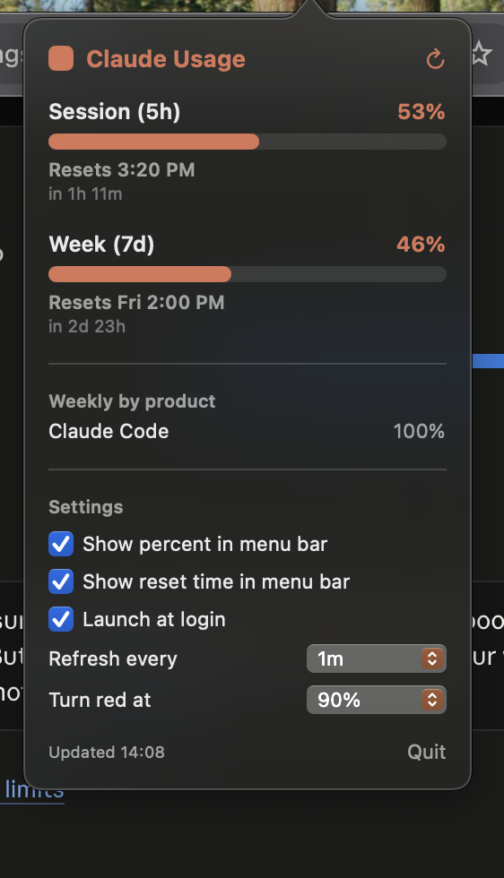

# Claude Usage Bar

A tiny native macOS menu-bar widget that shows your Claude subscription usage —
the 5‑hour session window and the 7‑day weekly window — so you never have to open
the browser to check where you stand.

<p align="center">
  
</p>

<p align="center">
  
</p>

## What it shows

- **Menu bar:** a compact Claude-coral pill with your **session** usage `%` and a live
  countdown to reset, e.g. `50% | 1h 13m`. It deepens to red once you cross a warning
  threshold.
- **Click to expand:**
  - **Session (5h)** and **Week (7d)** bars, each with the exact `%`, the **absolute
    reset clock-time** ("Resets 3:20 PM") and the countdown beneath it ("in 1h 11m").
  - Per-model weekly caps (Opus / Sonnet) when your plan reports them.
  - **Weekly by product** breakdown (Claude Code, Chats, etc.).
  - A settings section.
- **Notifications** when a window crosses your chosen threshold (once per window).
- **Refreshes on wake** so the numbers are current right after your Mac sleeps.

## Download

Grab the latest `ClaudeUsage.zip` from the
[Releases](https://github.com/Wandile-Mtshwene/claude-usage-bar/releases) page, unzip,
and move `ClaudeUsage.app` to `/Applications`. The build is ad-hoc signed (not notarized),
so the first launch needs a Gatekeeper nudge:

```bash
xattr -dr com.apple.quarantine /Applications/ClaudeUsage.app
open /Applications/ClaudeUsage.app
```

(or right-click the app → **Open** → **Open**). Prefer building it yourself? See
[Build & run](#build--run).

## How it works

- Usage comes from the same endpoint the Claude usage page uses:
  `GET https://api.anthropic.com/api/oauth/usage`.
- Authentication uses your existing **Claude Code OAuth token**, read live from the
  macOS Keychain (item `Claude Code-credentials`). Claude Code keeps that token fresh,
  so the app simply re-reads it on each poll — there is no separate login and **no token
  is ever stored in this repo or written to disk by the app**.

> Note: `api.anthropic.com/api/oauth/usage` is an undocumented endpoint. It works today
> but Anthropic could change it at any time. This is a personal convenience tool, not an
> official product.

## Requirements

- macOS 13 or later
- Xcode command-line tools (`xcode-select --install`) — provides `swiftc`
- Claude Code signed in at least once (so the Keychain item exists)

## Build & run

```bash
git clone https://github.com/Wandile-Mtshwene/claude-usage-bar.git
cd claude-usage-bar
./build.sh
open ClaudeUsage.app
```

The app lives in your menu bar (no Dock icon). On first run macOS may ask to allow
access to the `Claude Code-credentials` Keychain item — click **Always Allow**. To keep
it around, drag `ClaudeUsage.app` into `/Applications`.

## Settings

Click the pill to open the panel:

- **Show percent in menu bar** — off collapses the pill to a small coral dot.
- **Show reset time in menu bar** — toggle the `| 1h 13m` countdown on/off.
- **Launch at login** — enabled by default; registered via `SMAppService`.
- **Refresh every** — 30s / 1m / 5m.
- **Turn red at** — 70% / 80% / 90%.
- **Notify at** — Off / 80% / 90% / 95% (fires a notification once per window crossing).

All settings persist across launches. The menu-bar countdown re-renders every 30s so it
stays accurate between network refreshes.

## Project layout

- `main.swift` — the whole app (AppKit menu bar + SwiftUI popover).
- `Info.plist` — bundle metadata (`LSUIElement` = menu-bar-only).
- `build.sh` — compiles with `swiftc` and assembles `ClaudeUsage.app` (ad-hoc signed).

## License

MIT — see [LICENSE](LICENSE).
